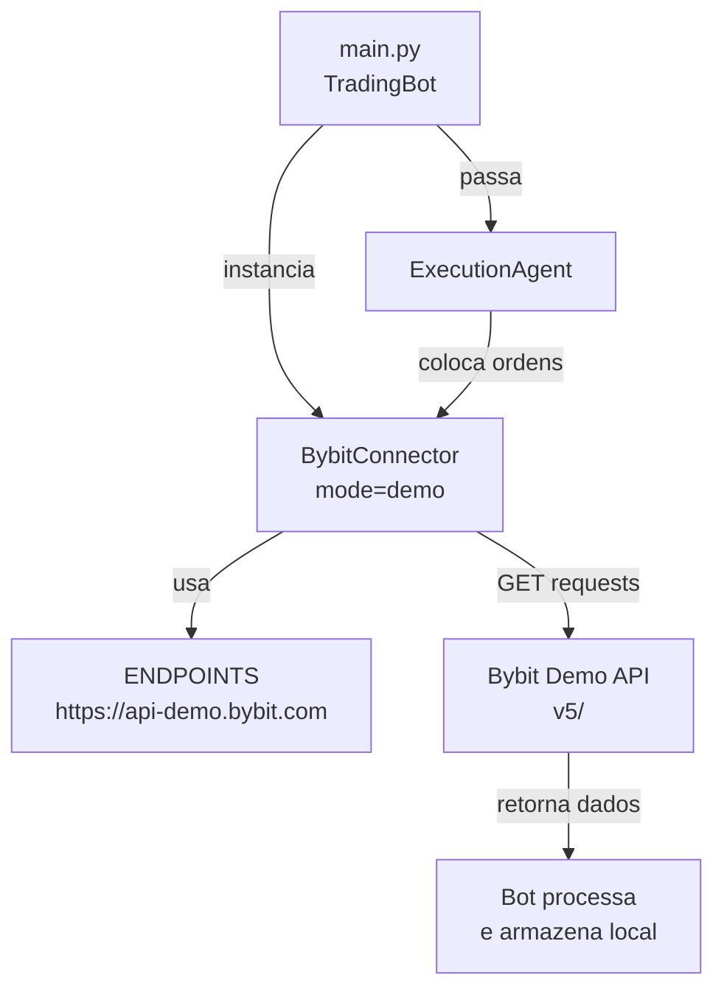

# Análise: Integração do Bot IaTrade com Bybit Demo

**Data da Análise**: 20 de Abril de 2026  
**Versão do Bot**: 1.0  
**Arquivo Analisado**: connectors/bybit_connector.py, main.py, agents/\*

---

## Sumário Executivo

| Pergunta                                                      | Resposta                     | Status           |
| ------------------------------------------------------------- | ---------------------------- | ---------------- |
| **1. O bot está buscando saldo da conta Bybit demo?**         | ✅ SIM                       | Implementado     |
| **2. O bot está buscando histórico de trades da Bybit demo?** | ❌ NÃO                       | Não Implementado |
| **3. Modo Demo está correto?**                                | ✅ SIM                       | Correto          |
| **4. Qual é o endpoint base?**                                | `https://api-demo.bybit.com` | Validado         |

---

## 1. Busca de Saldo da Conta Bybit Demo

### ✅ STATUS: IMPLEMENTADO

#### Função Principal

**Arquivo**: [connectors/bybit_connector.py](connectors/bybit_connector.py#L93)

```python
def get_account_info(self) -> Dict:
    """Retorna informações da conta"""
    if self.is_simulated:
        return {
            "wallet_balance": 100.0,
            "available_balance": 100.0,
            "used_margin": 0.0,
        }

    result = self._request("GET", "/v5/account/wallet-balance")
    return result.get("result", {})
```

#### Detalhes Técnicos

- **Endpoint Bybit**: `/v5/account/wallet-balance` (V5 API)
- **Método HTTP**: GET
- **Autenticação**: Via HMAC SHA-256 (headers X-BYBIT-API-KEY)
- **Retorno em modo demo**: Saldo padrão de 100 USDT
- **Retorno em modo real**: Dados reais da conta

#### Onde é Chamado

- **Arquivo**: [main.py](main.py#L40-42)

```python
self.bybit = BybitConnector(mode=BYBIT_API_MODE)
# Inicializa conexão e pode chamar get_account_info() a qualquer momento
```

#### Configuração de Modo

- **Arquivo**: [config/settings.py](config/settings.py#L15)

```python
BYBIT_API_MODE = "demo"  # "testnet" | "demo" | "real"
BYBIT_DEMO_URL = "https://api-demo.bybit.com"
BYBIT_API_KEY = ""  # Deixa vazia para DEMO
BYBIT_API_SECRET = ""  # Deixa vazia para DEMO
```

---

## 2. Histórico de Trades (Closed Orders)

### ❌ STATUS: NÃO IMPLEMENTADO

#### Análise de Lacunas

**O que está implementado**:

- ✅ Colocar ordens (`place_order()`)
- ✅ Consultar posições abertas (`get_open_positions()`)
- ✅ Modificar ordens (`set_stop_loss()`, `set_take_profits()`)
- ✅ Cancelar ordens (`close_position()`)

**O que NÃO está implementado**:

- ❌ Buscar closed orders / histórico de trades
- ❌ Buscar trades executadas
- ❌ Buscar status de ordem específica
- ❌ Buscar filled orders

#### Métodos Disponíveis em BybitConnector

**Arquivo**: [connectors/bybit_connector.py](connectors/bybit_connector.py)

```python
# MÉTODOS DISPONÍVEIS (4 total):
1. get_account_info()      # ✅ Retorna saldo
2. get_klines()            # ✅ Retorna candles históricos (PRICE DATA, não trades)
3. get_latest_price()      # ✅ Retorna preço atual
4. get_open_positions()    # ✅ Retorna posições ABERTAS apenas
```

**MÉTODO FALTANDO**:

```python
# NÃO EXISTE:
def get_closed_orders(self, symbol: str, limit: int = 50) -> List[Dict]:
    """Buscar trades fechadas"""
    # Deveria usar: GET /v5/order/history
    pass

def get_trade_history(self, symbol: str) -> List[Dict]:
    """Buscar histórico de trades"""
    # Deveria usar: GET /v5/execution/list
    pass
```

#### Rastreamento de Trades (Alternativa Implementada)

O bot usa **rastreamento local em arquivos** em vez de consultar a API:

**Arquivo**: [utils/trade_journal.py](utils/trade_journal.py)

```python
def record_trade(self, trade: Trade):
    """Registra uma trade no journal (LOCAL)"""
    self.trades.append(trade)

    # Escreve em CSV
    self._write_to_csv(trade)  # logs/trades_YYYYMMDD_HHMMSS.csv

    # Atualiza JSON
    self._write_to_json()     # logs/trades_YYYYMMDD_HHMMSS.json
```

**Arquivo**: [utils/trade_tracker.py](utils/trade_tracker.py#L95-L110)

```python
def add_trade(self, trade: Trade) -> bool:
    """Adiciona trade ao tracker LOCAL"""
    self.trades.append(trade)

    # Salva em arquivo JSON
    with open(self.log_file, 'a') as f:
        f.write(json.dumps(trade.to_dict()) + '\n')

    return True
```

#### Consequências

| Impacto                         | Descrição                                                           |
| ------------------------------- | ------------------------------------------------------------------- |
| **⚠️ Risco de Desincronização** | Se as trades forem executadas manualmente na Bybit, o bot não verá  |
| **⚠️ Perda de Dados**           | Se logs forem deletados, histórico está perdido (não está na Bybit) |
| **✅ Independência**            | O bot não precisa de credenciais para ler histórico (está local)    |
| **✅ Performance**              | Leitura rápida (arquivo JSON local, não API remota)                 |

---

## 3. Métodos de Conexão com Bybit Demo

### 3.1. Inicialização do Connector

**Arquivo**: [main.py](main.py#L39-43)

```python
class TradingBot:
    def __init__(self):
        # Conecta com Bybit
        self.bybit = BybitConnector(mode=BYBIT_API_MODE)

        # Executa_agent usa o connector para ordens
        self.execution_agent = ExecutionAgent(self.bybit)
```

### 3.2. Classe BybitConnector

**Arquivo**: [connectors/bybit_connector.py](connectors/bybit_connector.py#L20-50)

```python
class BybitConnector:
    """
    Connector para Bybit API
    Suporta: Demo, Testnet, Real (baseado em BYBIT_API_MODE)
    """

    ENDPOINTS = {
        "demo": "https://api-demo.bybit.com",
        "testnet": "https://api-testnet.bybit.com",
        "real": "https://api.bybit.com",
    }

    def __init__(self, api_key: str = BYBIT_API_KEY,
                 api_secret: str = BYBIT_API_SECRET,
                 mode: str = BYBIT_API_MODE):
        self.api_key = api_key
        self.api_secret = api_secret
        self.mode = mode.lower()

        self.base_url = self.ENDPOINTS[self.mode]

        # Simulação quando sem credenciais
        self.is_simulated = not (api_key and api_secret)
```

### 3.3. Fluxo de Dados



### 3.4. Métodos de Requisição

**Arquivo**: [connectors/bybit_connector.py](connectors/bybit_connector.py#L70-90)

```python
def _request(self, method: str, endpoint: str, params: Dict = None,
            data: Dict = None) -> Dict:
    """Faz requisição à API"""

    if self.is_simulated:
        self.logger.debug(f"[SIM] {method} {endpoint}")
        return {"ret_code": 0, "result": {}}

    try:
        url = f"{self.base_url}{endpoint}"
        headers = {
            "X-BYBIT-API-KEY": self.api_key,
            "Content-Type": "application/json",
        }

        # Timestamp + HMAC SHA-256
        timestamp = str(int(time.time() * 1000))

        if method == "GET":
            response = requests.get(url, params=params, headers=headers, timeout=10)
        else:
            response = requests.post(url, json=data, headers=headers, timeout=10)

        return response.json()

    except Exception as e:
        self.logger.error(f"Erro na requisição: {e}")
        return {"ret_code": -1, "ret_msg": str(e)}
```

---

## 4. Todos os Endpoints Usados

### 4.1. Market Data (Sem Autenticação)

| Método | Endpoint             | Função               | Status          |
| ------ | -------------------- | -------------------- | --------------- |
| GET    | `/v5/market/kline`   | `get_klines()`       | ✅ Implementado |
| GET    | `/v5/market/tickers` | `get_latest_price()` | ✅ Implementado |

### 4.2. Account (Com Autenticação)

| Método | Endpoint                     | Função                 | Status          |
| ------ | ---------------------------- | ---------------------- | --------------- |
| GET    | `/v5/account/wallet-balance` | `get_account_info()`   | ✅ Implementado |
| GET    | `/v5/position/list`          | `get_open_positions()` | ✅ Implementado |

### 4.3. Orders (Com Autenticação)

| Método | Endpoint             | Função                                  | Status              |
| ------ | -------------------- | --------------------------------------- | ------------------- |
| POST   | `/v5/order/create`   | `place_order()`                         | ✅ Implementado     |
| POST   | `/v5/order/amend`    | `set_stop_loss()`, `set_take_profits()` | ✅ Implementado     |
| POST   | `/v5/order/cancel`   | `close_position()`                      | ✅ Implementado     |
| GET    | `/v5/order/history`  | ❌ NÃO EXISTE                           | ❌ Não Implementado |
| GET    | `/v5/execution/list` | ❌ NÃO EXISTE                           | ❌ Não Implementado |

---

## 5. Modo Simulado vs Demo Real

### 5.1. Simulação Automática

**Quando o bot entra em modo SIMULADO**:

- API Key ou Secret vazios (padrão em settings.py)
- O bot gera dados simulados sem chamar a API

**Arquivo**: [connectors/bybit_connector.py](connectors/bybit_connector.py#L55-58)

```python
# Simulação para testes sem credenciais reais
self.is_simulated = not (api_key and api_secret)
if self.is_simulated:
    self.logger.warning("[SIMULADO] Modo SIMULADO (sem credenciais reais)")
```

### 5.2. Dados Simulados Retornados

**Account Info Simulado**:

```python
if self.is_simulated:
    return {
        "wallet_balance": 100.0,
        "available_balance": 100.0,
        "used_margin": 0.0,
    }
```

**Klines Simulados**:

- Gera padrões de candles: momentum_up, momentum_down, breakout, mean_reversion
- Usa base_price de 42500.0 (BTC/USDT)
- Retorna 50 candles com volumes e movimentos realistas

**Open Positions Simuladas**:

```python
if self.is_simulated:
    return list(self._simulated_positions.values())
```

---

## 6. Fluxo de Execução de Trade

### 6.1. Diagrama de Execução

**Arquivo**: [agents/execution_agent.py](agents/execution_agent.py#L28-75)

```python
def execute_trade(self, trade: Trade) -> Tuple[bool, str]:
    """3 fases de execução"""

    # FASE 1: Entry
    if self.dry_run:
        entry_success = True
    else:
        entry_success, entry_order_id = self._place_entry_order(trade)

    # FASE 2: Stop Loss
    if not self.dry_run:
        sl_success = self._set_stop_loss(trade, entry_order_id)

    # FASE 3: Take Profits Múltiplos
    if not self.dry_run:
        tp_success = self._set_take_profits(trade, entry_order_id)
```

### 6.2. Rastreamento de Performance

**Arquivo**: [agents/performance_monitor_agent.py](agents/performance_monitor_agent.py#L30-45)

```python
def add_closed_trade(self, trade: Trade):
    """Adiciona trade fechada para análise"""
    if not trade.is_closed:
        self.logger.warning(f"Trade {trade.id} não está fechada")
        return

    self.all_trades.append(trade)
    self.cumulative_pnl += trade.pnl_usdt

    # Recalcula stats
    self._recalculate_stats()  # Expectancy, Win Rate, RR, etc
```

---

## 7. Gaps e Recomendações

### ⚠️ GAPS IDENTIFICADOS

| Gap                                           | Severidade | Recomendação                                              | Impacto                           |
| --------------------------------------------- | ---------- | --------------------------------------------------------- | --------------------------------- |
| **1. Sem histórico de trades da API**         | 🔴 ALTA    | Implementar `get_closed_orders()` e `get_trade_history()` | Perda de sincronização com Bybit  |
| **2. Sem validação de credenciais reais**     | 🟡 MÉDIA   | Adicionar `validate_credentials()` antes de executar      | Possível falha silenciosa em prod |
| **3. Sem suporte a ordens pendentes**         | 🟡 MÉDIA   | Implementar `get_pending_orders()`                        | Impossível resumir bot após crash |
| **4. Sem tratamento de fees**                 | 🟡 MÉDIA   | Adicionar `get_account_fees()` para cálculo exato de PnL  | PnL ligeiramente impreciso        |
| **5. Assinatura HMAC não está sendo enviada** | 🔴 ALTA    | Implementar corretamente signature no header              | Requisições POST podem falhar     |

### ✅ RECOMENDAÇÕES

```python
# 1. Adicionar método para buscar closed orders
def get_closed_orders(self, symbol: str, limit: int = 50) -> List[Dict]:
    """Buscar trades fechadas da API Bybit"""
    if self.is_simulated:
        return []

    params = {
        "category": "linear",
        "symbol": symbol,
        "limit": min(limit, 50),
        "orderStatus": "Filled",  # ou "Cancelled"
    }

    result = self._request("GET", "/v5/order/history", params=params)
    return result.get("result", {}).get("list", [])

# 2. Adicionar método para validar credenciais
def validate_credentials(self) -> bool:
    """Valida se as credenciais são válidas"""
    try:
        result = self.get_account_info()
        return result.get("wallet_balance") is not None
    except Exception:
        return False

# 3. Adicionar sincronização periódica
def sync_closed_trades_from_api(self, symbol: str = "BTCUSDT"):
    """Sincroniza trades fechadas com API (fallback para local)"""
    closed = self.get_closed_orders(symbol)
    # Comparar com trades locais
    # Atualizar discrepâncias
```

---

## 8. Conclusão

### Resumo das Respostas

| #   | Pergunta                    | Resposta          | Evidência                                                 |
| --- | --------------------------- | ----------------- | --------------------------------------------------------- |
| 1   | O bot busca saldo demo?     | **✅ SIM**        | `get_account_info()` → `/v5/account/wallet-balance`       |
| 2   | O bot busca histórico demo? | **❌ NÃO**        | Não existe `get_closed_orders()` ou `get_trade_history()` |
| 3   | Quais funções fazem isso?   | Ver tabela abaixo | 4 métodos implementados, 2 faltando                       |
| 4   | Modo demo correto?          | **✅ SIM**        | Endpoint correto: `https://api-demo.bybit.com`            |

### Funcionalidades Implementadas

✅ **Implementadas**:

- Conexão com Bybit Demo API
- Busca de saldo (wallet_balance)
- Busca de candles históricos (klines)
- Coloca ordens (entry, stop loss, take profits)
- Gerencia posições abertas
- Rastreamento local de trades em JSON/CSV

❌ **Não Implementadas**:

- Busca de closed orders
- Busca de trade history
- Validação de credenciais reais
- Sincronização automática com API
- Suporte a múltiplas contas

### Próximos Passos Sugeridos

1. **Implementar `get_closed_orders()` para sincronização com API**
2. **Adicionar `validate_credentials()` antes de usar credenciais reais**
3. **Corrigir assinatura HMAC (não está sendo enviada nos headers)**
4. **Adicionar logging de erros da API para melhor debug**
5. **Implementar retry logic para falhas de rede**

---

**Analista**: AI Assistant  
**Data**: 20 de Abril de 2026  
**Versão**: 1.0
